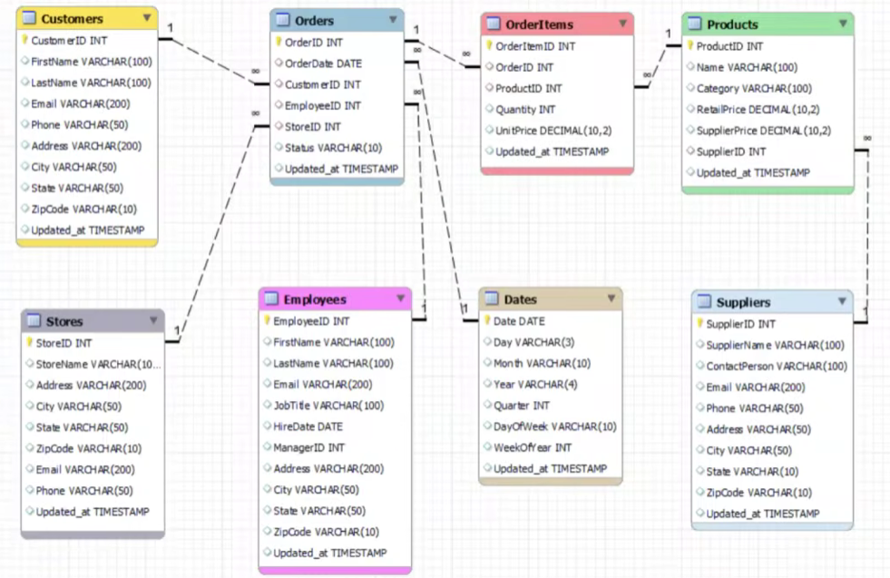
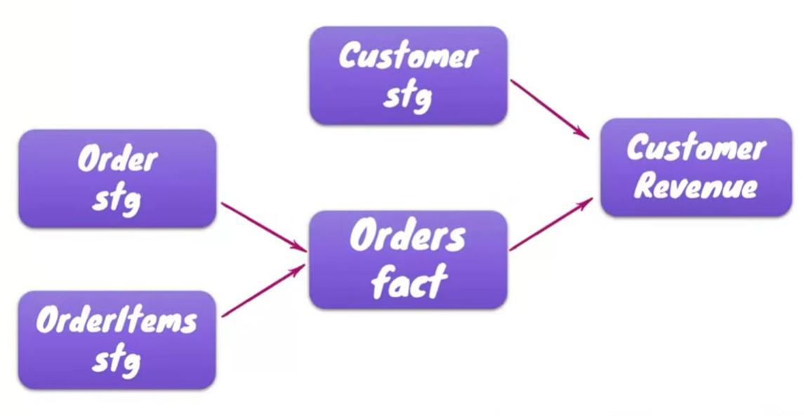
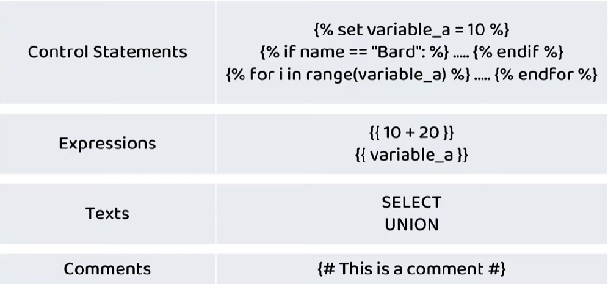

# Welcome to my dbt first project - tutorial

# Learning source
- dbt Tutorial (Data Build Tool) Hands-on-courese - Youtube from SleekData
- https://github.com/MarkPhamm/dbt-Fundamental for reading, summary and reference
I recommend you should watch tutorial and read MarkPhamm's github at the same time
- https://github.com/sleekdata/oms-db-setup for setting up database. Remember to change some syntax if you are using BigQuery like me instead of Snowflake. There are 10 .sql file to initialize database. The content of the 10th .sql file will create new schema which I use to practice with macro. You can read its README for more details.
# Commands that I learned during the project 
### Note: For more details, check MarkPhamm's github, he already helps us to summarize all of the neccessary thing.
- ```dbt init```: for BigQuery dbt project intialization, when we input for project -it should be our project-id that has already existed on cloud and we also use need to authorize ourself with following command gcloud auth application-default login when we choose oath method to use ADC.
- ```dbt debug```: checking is everything ok after dbt init
- ```dbt run```: Because one of the strength of dbt is that we do not need to deal with DDL/DML statement, we need to have this command to help us deal with that problem. You can think like we go to buffet restaurant and use DQL to choose data (raw food), then dbt run will help us to DDL and DML into edible food (table or view). So our job is choosing we wanted data and how should data be cooked, other part just give to dbt run. 
- ```{{ ref('old model') }}``` to reuse old model. We do not need to specify the specific path if
.sql file is in subfolder of models (like staging or mart). dbt helps us to scan the whole models folder. Therefore, when naming, we should gives each models a uniqe name.
- ```dbt seed```: loading CSV file in seeds folder to DW.
- ```dbt compile```: compile .sql adhoc query in analyses folder into raw sql files without executing them.
- ```dbt test```: apply test to models
- ```dbt source freshness```: check the current freshness of the project's sources
- ```{{ source('defined_schema_name','defined_table_name')  }}```: to points our defined name to sources name.
- ```{{ doc(% docs model_name %)}}``` writing doc here ```{{ doc(% enddocs %)}}```: so we can reuse doc, support DRY coding principle.
- ```dbt docs generate```: create catalog.json file doc in target folder. This is the command we use to refresh the view docs
- ```dbt docs serve```: create local host interface for us to see doc
# Entity relationship diagram in my project 


# Concept
## Note
- Two yml files that we need to understand and interact with most of the time: profiles.yml ( in Ubuntu its path is ~/.dbt/profiles.yml) and dbt_project.yml ( right in our dbt project ) 
## Materialization: {{ config(materialized='__') }}
- View: 
    + Store only SQL definition, no real data on disk. 
    + Run every time the view is queried
    + Building time is fast, but slow for downstream query if data is large or query is complex.
    + Incurs compute costs every time someone queries the view.
    + Always show latest live data in the source table. 
- Table:
    + Store actual computed data on physical disk.
    + Run only once during the dbt run and store result to storage.
    + Building time is slow becase it need to really compute and write data to disk, but fast for downstream query
    + Incurs compute costs during dbt run but downstream queries only scan the pre-built table.
    + Cannot update latest data. We need to regularly dbt run.
- Incremental - like table but have some difference:
    + Appends or updates only new/changed records since the last run while table builds everything again per run.
    + Build time is faster than table.
    + Lower warehouse cost because it scans significantly fewer rows per run.
    + Requires defining an is_incremental() macro filter and a unique key to handle updates.
    + Requires configuration to prevent duplicate records.
## Modularity
- Breaking donw large models into multiple smaller models.
- Better for readability, reuseability, maintainanbility, scalability, testability. 

## Naming convention
- Source (src): refer to raw table data in DW which is the result of loading process.
- Staging (stg): tables that are built directly from source with one to one relationship. Have very light transformation (kind of formatting and cleaning). These are typically materialized as view
- Intermediate (int) any table or data that exists between stg and final fact/dim table.
- Fact: a table that describes an event (session, transaction, orders,...).
- Dim: a table that describes an object (human, building, department,...).
## Schema
- A namespace or container inside our datawarehouse (different from our models folder in local machine) where dbt builds and stores your transformed tables and views.
- By default, dbt builds and stores all models in target schema (which we can find in profiles.yml). Or we can custom models' schema in dbt_project.yml (individually or collectively).
## Project Organization (on our local machine in models folder) - below is just my favor. You can change to follow your needs.
- Staging subfolder: stores all staging models
- Marts subfolder:  stores all intermediate models.
- Final subfolder: stores all consumption models (which end user can directly use).
# seeds
- Folder that contains CSV files which are loaded into our DW by dbt seed command.
- We just should use it when our data is static and infrequently changed such as country, zip code, location, ... 
- We can also use ref function to refer to table that comes from seed like the regular models.
# analyses
- Folder that contains .sql file using for adhoc query and analysis on top of DW.
- Therefore, data from .sql file is not materialized as table or view.
- Basically, it just like normal SQL we use but we can leverage dbt syntax like ref fucntion to write it easier.
- We can use dbt compile command to compile .sql file in analyses folders into raw .sql file. Then we can find it in target/compiled/project_name/analyses/name, copy and paste it in Bigquery to run adhoc query
# sources.yml file
- Is used to declare and document our raw input data tables that already exist in your data warehouse before dbt runs. ( the data that comes from loading process )
### Note: Never use for intermediate
- We do not need to hardcode the paths to raw table for staging models. 
- Allows dbt to build a complete Data Lineage Graph (DAG) showing where raw data enters transformations.
- Help us to check the freshness of the table.
- In my source.yml file, you can see (the name and the identifier) - for table or (the name and the schema) - for schema. When we change the name of the raw table, we just need to change the name of the identifier in .yml file. You can think name is the pointer that points to identifier. So the name in each staging model remains the same but the destinations of their pointer change to new name - which we just need to change only one line in source.yml.
```sql
    {{ source('landing', 'cust') }}
```
equivalently means
```sql
    L1_LANDING.CUSTOMERS
```
# dbt document
- There are several reasons why we need to have documentations:
    + Communitcation among skateholders
    + New members can quickly understand
    + Readability and Maintainability
- One of the strength of dbt is auto-generated documentations.
- ```description``` in .yml is also a way for us to manually write short doc for models or sources.
- Another way is use .md file in models folder, we use it for large and support DRY coding principle. It just like writing README file except it starts with 
```sql
    
```
and end with
```sql
    
``` 
then we can just references the doc blocks in .yml file:
```code
-   name: orders_stg
    description: Staged orders data from order management system (oms), with minor row-level transformations.  
    columns:
      - name: OrderID
        description: The primary key for orders_stg table.      
        tests:
          - unique
          - not_null

      - name: StatusCD
        description: "{{ doc('StatusCD') }}" #instead of writing text right here
        tests:
          - accepted_values:
              values: ['01', '02', '03']
```  
- For models, descriptions can happen at the model, source, or column level.
# tests
- There are two types of tests:
+ Generic: kind of evolving from singular test. Instead of writing many singular tests with same logic for many different models, we can use generic test by parameterizing the model name and column name.
+ + There are two ways that we can put generic test: one is generic subfolder in models, another one is in macros.
+ Singular: writing a SQL query that identifies failing record. A singular test just can be used only for one model, it cannot be used across many ones because the table ref() function is hard coded.
### Note: We can also apply test in source.yml with the same manner in oms_config.yml
## 4 built-in generic tests
+ Not_null: ensures no columns have null values.
+ Unique: ensures each row in table is unique.
+ Accepted_values: ensure column values are within the specified values.
+ Relationships: ensures the relationships between tables are correct.
## Test Coverage
- (No of test scenarios executed / Total no of test scenarios) *100
# Jinja
- In dbt, there are 3 main languages that we use:
    + SQL: for writing test and models.
    + YAML: for configuration
    + Jinja: to make SQL and YAML dynamic
- Belows are some jinja statement:

# macros
- Just like writing user defined function in Python except in dbt, it does not require return keyword.
- macro ~ SQL + jinja.
- As we can see, the main usage of macro is for reusing code block across multiple models, maintainability.
# Errors that I meet during this project.
- Remember to first authorize with ACD before or after the dbt init by using gcloud auth application-default login. (Just right if you use dbt-bigquery)
- If you want to see dependencies graph (Lineage) of models, you need to install Power User for dbt. But after installation, and it shows error like "No dbt core" then it may be choosing the global Python interpreter, you should change it to python interpreter in your venv where you install dbt.
# Reference Resources from dbt:
- Learn more about dbt [in the docs](https://docs.getdbt.com/docs/introduction)
- Check out [Discourse](https://discourse.getdbt.com/) for commonly asked questions and answers
- Join the [chat](https://community.getdbt.com/) on Slack for live discussions and support
- Find [dbt events](https://events.getdbt.com) near you
- Check out [the blog](https://blog.getdbt.com/) for the latest news on dbt's development and best practices
# END